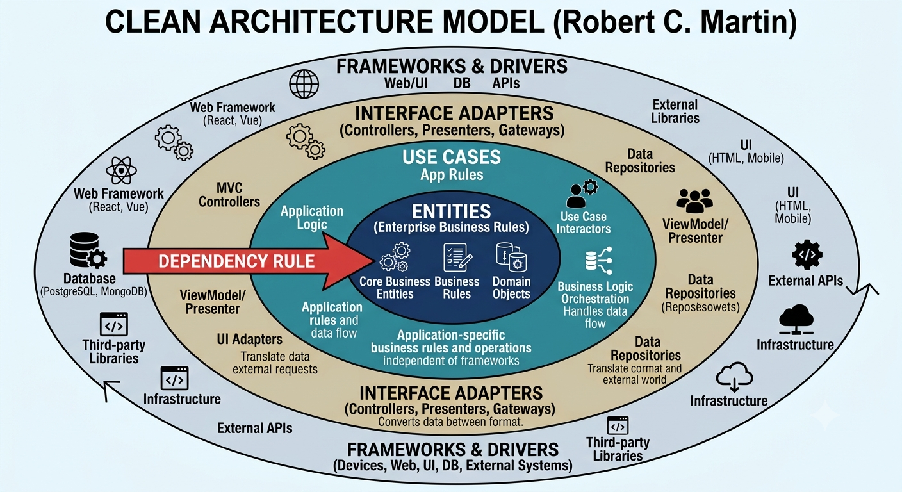

# 🎙️ Ecko

<div align="center">


Aplicación de chat moderna y en tiempo real

</div>

---

## 📋 Descripción

**Ecko** es una plataforma de chat colaborativo en tiempo real que permite a los usuarios crear servidores, organizar canales de comunicación e intercambiar mensajes de forma instantánea. Construida con las tecnologías más modernas de React y arquitectura limpia, garantiza seguridad de tipos, rendimiento optimizado y experiencia de usuario fluida.

### 🎯 Objetivos Principales

- **Comunicación en Tiempo Real**: Mensajería instantánea mediante WebSocket STOMP
- **Organización Flexible**: Servidores y canales para estructurar conversaciones
- **Adjuntos de Archivos**: Compartir imágenes y documentos dentro de los mensajes
- **Experiencia Moderna**: UI responsiva y accesible con Tailwind + Radix UI
- **Código Mantenible**: Clean Architecture con separación clara de capas
- **Type Safety**: TypeScript strict mode en todo el proyecto
- **Performance**: React Compiler automático + React Query para sincronización eficiente

## ✨ Características Principales

### 💬 **Mensajería en Tiempo Real**

- Envío de mensajes instantáneo vía WebSocket STOMP
- Indicadores de escritura en tiempo vivo
- Reacciones con emoji a los mensajes
- Historial completo de conversaciones

### 🎙️ **Mensajes de Audio**

- Grabación de mensajes de voz con el micrófono (`MediaRecorder API`)
- Envío por HTTP multipart al server
- Reproducción con reproductor custom (play/pausa + barra de progreso)
- Audios almacenados en Cloudinary con entrega `authenticated` (URLs firmadas temporalmente)

### 📎 **Archivos Adjuntos**

- Compartir imágenes y documentos (PDF, Word, Excel, PowerPoint, texto plano)
- Adjuntar mediante selector de archivos o arrastrar y soltar sobre el input
- Vista previa de los archivos pendientes antes de enviar (miniaturas para imágenes)
- Caption opcional: mensaje de texto que acompaña al archivo
- Descarga directa del archivo con botón en el mensaje
- Iconos de formato con SVGs de marca (pdf, word, excel, json, txt) y fallback a Lucide
- Máximo 25 MB por archivo; almacenados en Cloudinary `authenticated` con URLs firmadas

### 🏢 **Gestión de Servidores**

- Crear servidores personalizados
- Códigos de invitación únicos para nuevos miembros
- Unirse a servidores mediante código
- Gestión de usuarios activos

### 📢 **Organización por Canales**

- Múltiples canales por servidor
- Crear y editar canales
- Separación de temas y conversaciones
- Historial de mensajes por canal

### 🎨 **Experiencia de Usuario**

- Interfaz responsiva y moderna
- Componentes accesibles (Radix UI)
- Indicadores visuales de estado
- Modo de navegación intuitivo

### 🔐 **Seguridad**

- Autenticación con tokens JWT
- Validación de datos con Zod
- TypeScript strict mode
- Manejo seguro de credenciales

## 🏗️ Arquitectura - Clean Architecture

Este proyecto implementa **Clean Architecture de Robert C. Martin** con 4 capas independientes, donde las dependencias fluyen **hacia adentro** (Domain):



### Las 4 Capas

| Capa                | Ubicación               | Responsabilidad                                  | Dependencias |
| ------------------- | ----------------------- | ------------------------------------------------ | ------------ |
| 🎯 **Dominio**      | `domain/`               | Lógica de negocio, entidades ricas, interfaces   | NINGUNA      |
| 📋 **Aplicación**   | `application/usecases/` | Validar reglas, orquestar casos de uso           | Domain       |
| 🔧 **Datos**        | `data/`                 | Implementar repositorios, conectar API/WebSocket | Domain       |
| 🎨 **Presentación** | `presentation/`         | Componentes React, hooks, UI state               | Application  |

### Principios Aplicados

| Principio                         | Explicación                                                                                          |
| --------------------------------- | ---------------------------------------------------------------------------------------------------- |
| 🔄 **Inversión de Dependencias**  | Presentation → Application → Domain ← Data<br/>La capa más importante (Domain) no depende de nadie   |
| 💪 **Entidades Ricas de Dominio** | `Message.isOwnedBy()`, `Server.hasChannel()`<br/>Las entidades encapsulan lógica, no son DTOs vacíos |
| 🔌 **Patrón Repository**          | Interface en Domain, implementación en Data<br/>Cambia HTTP → WebSocket sin tocar el resto           |
| 🎮 **Capa de Casos de Uso**       | Cada usecase = 1 operación atómica<br/>Valida entrada, orquesta repos, define transacción            |
| 🛡️ **Sin Fugas de Framework**     | Domain = TypeScript puro, sin React/STOMP<br/>Testeable sin UI; reutilizable en cualquier contexto   |

## 📁 Estructura del Proyecto

El proyecto sigue **Clean Architecture** con 4 capas independientes:

```
app/
├── domain/                      # Capa de Dominio (lógica de negocio)
│   ├── models/                 # Entidades ricas con métodos de negocio
│   │   ├── auth.ts            # Modelo de autenticación
│   │   ├── message.ts         # Modelo de mensaje
│   │   ├── server.ts          # Modelo de servidor
│   │   ├── channel.ts         # Modelo de canal
│   │   └── index.ts
│   └── repositories/           # Interfaces de repositorios
│       ├── auth.repository.ts
│       ├── message.repository.ts
│       ├── server.repository.ts
│       ├── channel.repository.ts
│       └── token.repository.ts
│
├── application/                # Capa de Aplicación (casos de uso)
│   └── usecases/              # Orquestación de lógica de negocio
│       ├── SendMessageUseCase.ts
│       ├── CreateServerUseCase.ts
│       ├── JoinServerUseCase.ts
│       ├── CreateChannelUseCase.ts
│       ├── RegisterWithInviteUseCase.ts
│       ├── ValidateInviteCodeUseCase.ts
│       ├── RefreshTokenUseCase.ts
│       └── BaseUseCase.ts
│
├── data/                       # Capa de Datos (infraestructura)
│   ├── api/                   # Cliente HTTP (Ky)
│   │   └── client.ts
│   ├── repositories/          # Implementaciones de repositorios
│   │   ├── auth.repository.impl.ts
│   │   ├── message.repository.impl.ts
│   │   ├── server.repository.impl.ts
│   │   ├── channel.repository.impl.ts
│   │   └── token.repository.impl.ts
│   └── websocket/             # Cliente WebSocket STOMP
│       └── stompClient.ts
│
└── presentation/               # Capa de Presentación (UI React)
    ├── pages/                 # Páginas de la aplicación
    │   ├── index.tsx
    │   ├── protected/         # Rutas protegidas
    │   │   ├── layout.tsx
    │   │   ├── home.tsx
    │   │   └── chat.tsx
    │   └── public/            # Rutas públicas
    │       ├── login.tsx
    │       ├── join-with-code.tsx
    │       └── not-found.tsx
    ├── components/            # Componentes reutilizables
    │   ├── ServerNav.tsx
    │   ├── ChannelList.tsx
    │   ├── MessageList.tsx
    │   ├── MessageInput.tsx
    │   ├── MessageItem.tsx
    │   ├── MessageReactions.tsx
    │   ├── VoiceMessagePlayer.tsx
    │   ├── file-icon/         # Icono de archivo según tipo MIME
    │   │   ├── file-icon.tsx # Componente FileIcon (SVG de marca + fallback)
    │   │   └── rules.ts      # Reglas de mapeo MIME → icono
    │   ├── dialogs/           # Diálogos modales
    │   │   ├── AudioRecordDialog.tsx
    │   │   ├── CreateChannelDialog.tsx
    │   │   └── CreateServerDialog.tsx
    │   └── ErrorBoundary.tsx
    ├── hooks/                 # Custom hooks (React Query + casos de uso)
    │   ├── useAuth.ts
    │   ├── useServers.ts
    │   ├── useChannels.ts
    │   ├── useMessages.ts
    │   └── ...
    ├── store/                 # Estado global (Zustand)
    │   ├── authStore.ts
    │   └── uiStore.ts
    ├── providers/             # Context providers
    │   ├── AuthProvider.tsx
    │   └── AppProviders.tsx
    ├── router/                # Configuración de rutas
    │   ├── router.tsx
    │   ├── ProtectedRoute.tsx
    │   └── index.ts
    └── ui/                    # Componentes de UI (Radix/shadcn)
        ├── button.tsx
        ├── dialog.tsx
        ├── input.tsx
        └── ...
```

## 🛠️ Stack Tecnológico

- **[React 19.2.7](https://react.dev/)** - Librería UI con React Compiler
- **[TypeScript 5.9](https://www.typescriptlang.org/)** - Type safety (strict mode)
- **[Vite 8](https://vite.dev/)** - Build tool ultrarrápido
- **[Bun](https://bun.sh/)** - Runtime y package manager
- **[Zustand 5](https://zustand-demo.pmnd.rs/)** - Estado global (auth, UI)
- **[TanStack React Query 5](https://tanstack.com/query/)** - Sincronización de servidor
- **[React Hook Form 7](https://react-hook-form.com/)** - Manejo de formularios
- **[Zod 4](https://zod.dev/)** - Validación de esquemas
- **[@stomp/stompjs 7](http://stomp-js.github.io/)** - Cliente WebSocket STOMP
- **[Ky 2](https://github.com/sindresorhus/ky)** - Cliente HTTP
- **[Tailwind CSS 4](https://tailwindcss.com/)** - CSS utility-first
- **[Lucide React](https://lucide.dev/)** - Librería de iconos

## 🚀 Instalación

### Requisitos Previos

- **[Bun 1+](https://bun.sh)** - Runtime y package manager

### Pasos de Instalación

1. **Clonar el repositorio**

   ```bash
   git clone https://github.com/fgalluccio/ecko-client.git
   cd ecko-client
   ```

2. **Instalar dependencias**

   ```bash
   bun install
   ```

3. **Configurar variables de entorno**

   Crea un archivo `.env.development` (o `.env.production` para producción) en la raiz del proyecto:

   ```env
   VITE_API_URL=http://localhost:8081
   ```

4. **Iniciar servidor de desarrollo**

   ```bash
   bun run dev
   ```

5. **Abrir en el navegador**
   ```
   http://localhost:5173
   ```

## 🚀 Deployment

### Production

- **Cliente (UI):** Hosted en [Vercel](https://vercel.com)  
  🔗 **URL:** `https://ecko-client.vercel.app`

- **Servidor (API + WebSocket):** Hosted en [Render](https://render.com)  
  🔗 **URL:** `https://ecko-server.onrender.com`

- **Base de Datos:** PostgreSQL en [Neon](https://neon.tech)  
  🔗 **Proveedor:** Managed Postgres

## 🔧 Comandos Disponibles

```bash
# 🚀 Desarrollo
bun run dev           # Iniciar servidor de desarrollo con hot reload
bun run preview       # Previsualizar build de producción

# 🏗️ Build
bun run build         # Compilar para producción
bun run typecheck     # Verificación de tipos TypeScript

# ✨ Calidad de Código
bun run lint          # Ejecutar ESLint
bun run lint:fix      # Auto-corregir issues de linting
bun run format        # Formatear código con Prettier
bun run format:check  # Verificar formato de código
```

<div align="center">

**Ecko Client** - Construido con ❤️ por Franco Galluccio

</div>
